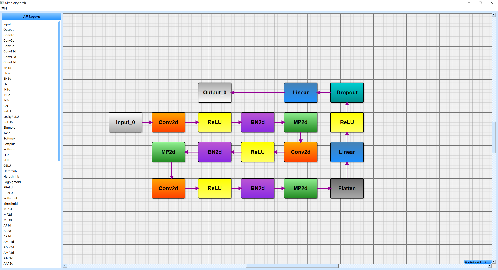

# SimplePytroch: 一个可视化神经网络编辑器，基于PyQt5 和 PyTorch

## 项目说明
本项目开发了一个UI界面，可以在简单的图形界面内可视化的搭建一个简单的神经网络，适合新手入门学习神经网络，适合快速生成一个简单的神经网络并验证其作用。<br>
本项目为作者开发的第一个项目，完全为个人兴趣，各种bug请包容并反馈~（虽然不一定会修）
## 环境配置
代码中已写好"requirements.txt"文件，使用`pip install -r requirements.txt`即可配置<br>
文件中包与库指定了作者自己运行时的版本，其他版本是否可行尚待验证
## UI界面操作说明
运行以下代码可以打开程序UI界面
```python
from core import tool

tool.start()
```
- 点击左侧模块区内顶部的"All Layers"，可以选择模块类别
- 单击选中具体模块
- 在右侧画布内单击可以预览模块，单击右键取消预览，单击左键放置
- 鼠标靠近模块时出现红点提示，此时单击左键可以连线，连线规定了神经网络的前向传播方法
- 单击左键已放置的模块，可以选中模块，此时可以长按拖动模块；可以再次单击，进入神经网络参数配置；可以按del键从图中删除模块
- 菜单栏中的文件内支持保存和打开工程，工程文件以.json格式存储
- 菜单栏中的文件内支持导出定义好的Pytorch模型
## 导出模型的使用
运行以下程序可以加载保存好的模型并打印模型结构至终端
```python
from core import tool

model = tool.load_model("Your Path To Model.pt", print_model=True)
```
## 测试文件
作者已写好训练和预测使用例，该使用例在CIFAR-10上进行训练和验证。<br>
在UI界面可以打开工程`test_model.josn`，该工程搭建了一个简单的CNN神经网络，并且设置好了各网络层参数，可以直接导出对应模型。<br>
训练文件和预测文件分别为`train.py`和`test.py`，运行对应文件可以进行模型的训练和预测
> 注意自行设置模型路径和数据集路径。有关数据集的用法这里不做介绍，请自行学习~
